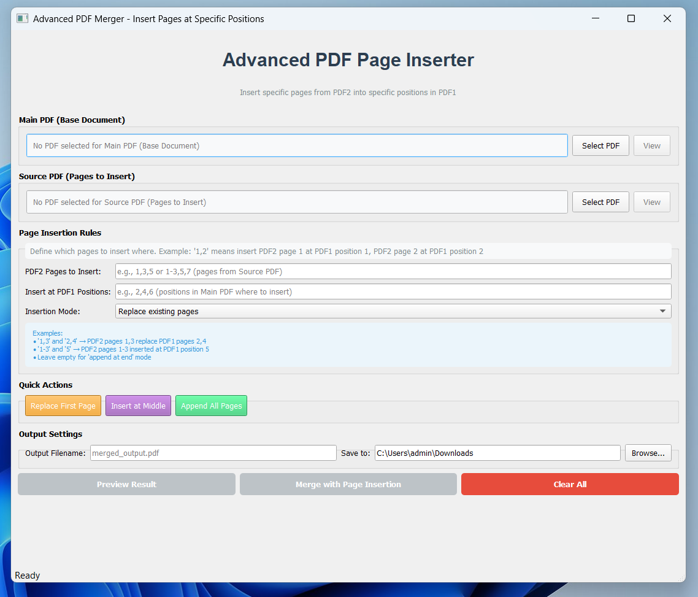

# Smart PDF Page Inserter

A user-friendly Python GUI application for inserting, replacing, and manipulating pages between PDF documents with automatic page resizing.



## ✨ Features

- **Smart Page Insertion**: Insert pages from one PDF into specific positions of another
- **Automatic Page Resizing**: Pages are automatically resized to match the target PDF
- **Multiple Modes**:
  - Replace existing pages
  - Insert before/after specific positions
  - Append at the end
- **Preview Functionality**: See exactly what will happen before merging
- **Intelligent Page Parsing**: Supports complex page ranges (1-5,7,9-12)
- **User-Friendly GUI**: Built with PyQt5 for professional interface

## 🚀 Installation

### Prerequisites

- Python 3.8 or higher
- pip package manager

### Install Dependencies

```bash
pip install PyQt5 PyMuPDF
```

Run the Application

```bash
python pdf_inserter.py
```

## 📖 How to Use

1. **Select PDFs**:

- Main PDF (base document)

- Source PDF (pages to insert)

2. **Define Insertion Rules**:

- Specify which pages from Source PDF

- Define positions in Main PDF

- Choose insertion mode

3. **Preview & Merge**:

- Preview the result

- Merge with one click

- Auto-open the result

## 🎯 Use Cases

- Replace specific pages in contracts/reports

- Insert updated charts into existing documents

- Combine chapters from different sources

- Fix/update pages without recreating entire PDFs

## 🛠️ Technical Details

- **Built With**: Python, PyQt5, PyMuPDF

- **Architecture**: MVC-like pattern with clean separation

- **Features**:

  - Automatic page size matching

  - Aspect ratio preservation

  - Progress tracking

  - Error handling

## 🤝 Contributing

- Contributions are welcome! Please feel free to submit a Pull Request.
